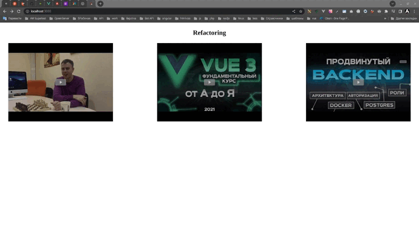
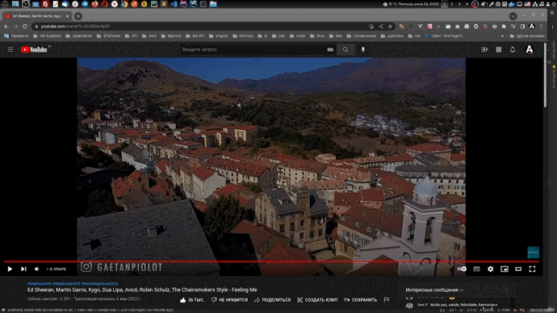

## Модуль вывода видео с ютуб в модальном окне

Модуль создает в заданном блоке или блоках, превью к видео с ютуб, сами видео не загужаются сразу на страницу, а открываются в модальном окне. Это позволяет оптимизировать сокрость загрузки контента, возможность листать слайдер swiper свайпами. 

## Инструкция:

Создаём класс: new WsVideo()

Вставляем код в HTML:

    

        
        

            
        

    

Пример вставки ссылки:

Все. Пользуемся.
